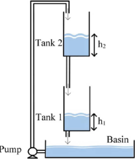
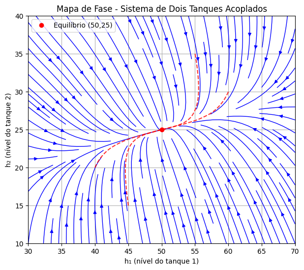

# Coupled Two-Tank System  
## Nonlinear Modeling, Linearization and Stability Analysis

  

This repository presents the mathematical modeling, linearization, and dynamic analysis of a nonlinear coupled two-tank hydraulic system.

The project integrates symbolic computation, numerical simulation, and control-theoretic analysis to investigate system stability and dynamic behavior.

## 🔎 Project Overview

The coupled tank system is a classical nonlinear benchmark in control engineering.  
This project develops:

- Nonlinear differential equations derived from mass balance principles
- Analytical equilibrium point computation
- First-order Taylor linearization using Jacobian matrices
- Stability verification via eigenvalue analysis
- Phase portrait visualization
- Comparative simulation between nonlinear and linearized models

The objective is to evaluate the validity of linear approximations and analyze dynamic coupling effects between tanks.

## 📐 Mathematical Model

The nonlinear system is described by the following equations:

    dh1/dt = [q1 - cv1 * sqrt(h1 - h2)] / a1

    dh2/dt = [q2 + cv1 * sqrt(h1 - h2) - cv2 * sqrt(h2)] / a2

Where:

- h1, h2 — tank liquid levels  
- q1, q2 — inlet flow rates  
- cv1, cv2 — valve discharge coefficients  
- a1, a2 — cross-sectional areas  

The system exhibits nonlinear square-root flow behavior typical of hydraulic dynamics.

## 🚀 Implemented Features

The notebook performs the following stages:

### 1️⃣ Symbolic Modeling
- Differential equations defined using `sympy`
- Automatic Jacobian matrix computation
- Analytical equilibrium point derivation

### 2️⃣ Linearization
- First-order Taylor expansion
- State-space representation:
  
      dx/dt = Ax + Bu

### 3️⃣ Stability Analysis
- Eigenvalue computation
- Asymptotic stability verification
- Dynamic time-scale interpretation

### 4️⃣ Phase Map Generation
- Vector field construction
- Trajectory visualization under perturbations
- Nonlinear convergence analysis

### 5️⃣ Numerical Simulation
- Integration via `scipy.solve_ivp`
- Step response comparison
- Linear vs nonlinear deviation analysis

## 📊 Example Results

### Phase Portrait

  

The nonlinear trajectories converge to the equilibrium point, confirming asymptotic stability.

### Linear vs Nonlinear Step Response

  

The linear model accurately approximates system behavior for small perturbations.

## 🧠 Control-Theoretic Insights

- The system is locally asymptotically stable
- Coupling between tanks creates multi-time-scale dynamics
- Linearization remains valid within bounded perturbation regions
- Eigenvalue distribution indicates overdamped behavior

## 🛠 Technologies Used

- Python  
- SymPy  
- NumPy  
- SciPy  
- Matplotlib  

